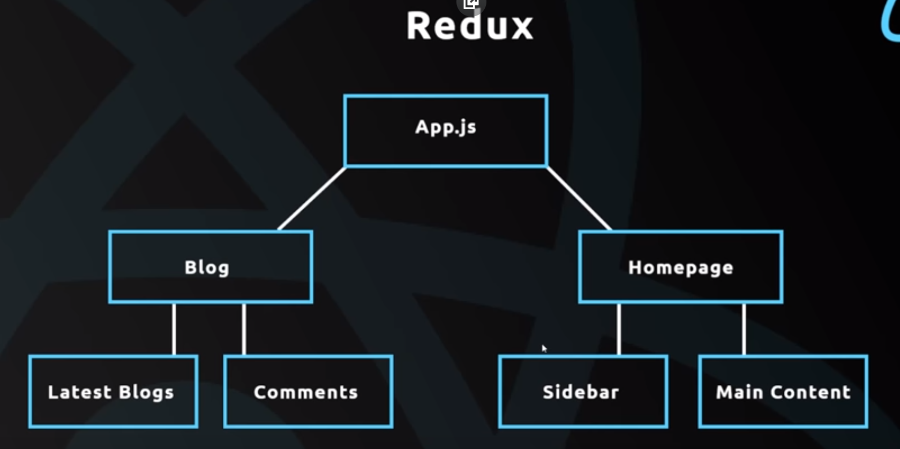
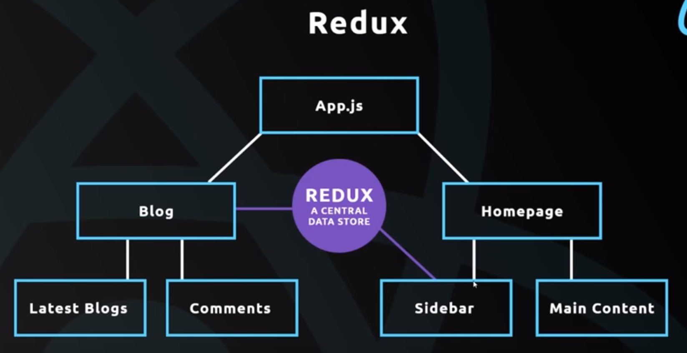
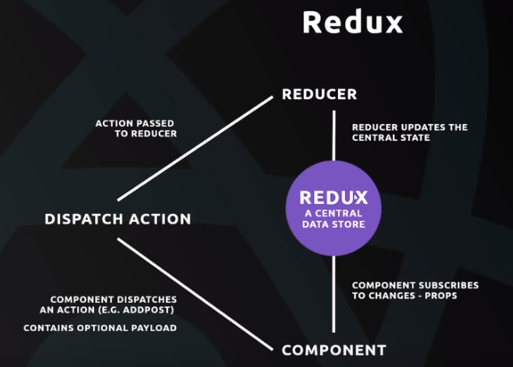
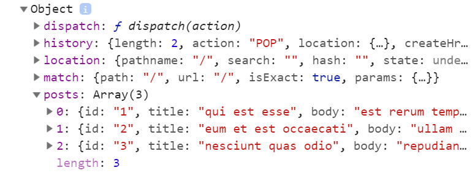
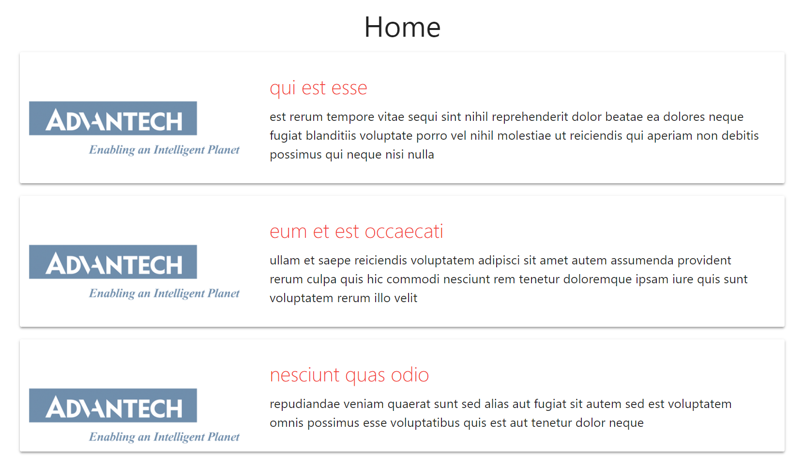

# Redux

## Introduction

- Central data store for all app data
- Any component in the application can access data from it
- Makes state management easy

The simple struture of our application



We have the ``Latest Blogs`` component that wants to show the latest some blogs, some data we get from an external source. But on the ``Homepage``, in the ``Sidebar``, we also want to show some latest blogs as well. So we want to kind of share the data. Both these components need the data. 

What we could do is, in the ``Blog`` component, reach out and grab some data from an external source, store it in the state of this component, and pass it down as props. Regarding the ``Sidebar``, we could the same thing -- reach out in the ``Homepage`` to go and get that data, store it on the state, and pass it down as props. But we are duplicating our code this way so it's propably not the best method for doing this.



With **Redux**, we can store all of our data that we need for the application and is going to be shared between components. If the ``Blog`` component wants some data, it can just reach out or listen to this central store and grab the data and pass it down into the sub component. It goes the same way to the ``Sidebar`` component. There is no convoluted method of passing data between different components around the whole application, and we don't need to duplicate our code.

<br>

## Safety Mechanism

The components can reach out to the central data store and grab some data but they cannot just directly edit the data on the store. That would be kind of unsafe in your application and may result to unpredictable code.

There is a process when working with Redux.



### Access the Data

- First of all, We define a central store with **Redux**, which is a JavaScript object. You may also call it a **central state**.
- If, in a component, we want to access some of that data, the component subscribes to changes to that data. And then a **Redux** passes the component that data in the form of **props** to that component. 

### Make a Change to the Data Store

- We, first of all, decide that we want to make a change.
- Then we **dispatch an action**. The actions describe the changes that we want to make, like ``adding a new post`` to the posts data.
- With the action, we can pass along an **optional payload**, which is any kind of data that we want to pass along. In this case, the payload is the data, the post which we want to add.
- That action is passed to the **Reducer**.
- The **Reducer** takes in the action and it looks the type and knows that this is an "add post" action. It will take the given data, go to the central data store or central state, and update it from here. So 

The **Reducer** is the thing that actually updates the data store, and all the changes are going to be made from here instead of being directly made from components. It will make your applications much easier to manage, especially when they get bigger.

<br>

## The First Look of Redux

- The **Redux central store** is a _JavaScript object_ which will represent our global state of the application. 
- The **Reducer** is a _function_ that interacts with the store in order to change the state of the data inside of it.
- You could think of this store as a warehouse storing the state or the data of your application, and you could think of the Reducer as a _robot_ which stands guard at the door of the warehouse. Only the robot can go inside the warehouse and edit the state of the store.
- When actions are dispatched from elsewhere in the application, this robot receives them and use those actions update the state inside the store, the warehouse.
- The state is always being updated from one single place, the robot or the Reducer.
- The Reducer function and the store are tightly coupled with each other so that when we create a store, we have to **pass that store a single Reducer function as a parameter** to that store. So that way, the store knows which Reducer will handle those changes. 

## Creating a Simple Store

Import the function.
```js
const { createStore } = Redux;
```

Create a store.

```js
// Invoke the function
const store = createStore();
```

We said the Store is tightly coupled with a Reducer, and we pass a Reducer into a Store as a parameter so that we know that those two are linked together, and store knows which Reducer will be interacting with it.

```js
// Coupling the store and the reducer
const store = createStore(myReducer);
```

myReducer is a function that interacts with the Store so now let's create the function. This function will take two parameters.

```js
function myReducer(state, action) {
  // This is where we do the interacting with the actual store
}
```

When the Reducer first interacts with the Store, it will not know the state because the state will not exist so we have to create an inital state to begin with for the Store. And then when it first starts, it passes that initial state into the Store via ``myReducer`` and it can set as that.

Let's create the inital state here.

```js
// Set the inital state equal to some kind of object.
const initState = {
  todos: [],
  posts: []
};
```

Pass the default state to the Reducer.

```js
// The Reducer is just a function, and 'state' represents the state of the Store.
function myReducer(state = initState, action) {

}
```

So the first time that ``myReducer`` fires, it will notice that we don't have any state here so it will use the ``initState`` as a default value for the state.

The code we have so far:
```js
const { createStore } = Redux;

const initState = {
  todos: [],
  posts: []
};

function myReducer(state = initState, action) {

}

const store = createStore(myReducer);

```

<br>

## Create an Action

An Action is just a JavaScript object and it has a ``type`` property that describes the action. The Action also has an optional ``payload`` of data.

```js
// Adding a new todo with an Action
const todoAction = {
  type: 'ADD_TODO', // Normally you see the type in capital letters.
  todo: 'buy milk' // You can call the payload whatever you want.
};
```

What disptaching an Action means we are passing the Action in to the Reducer. The Reducer can therefore take that Action and can see that it's an ``ADD_TODO`` so it knows that we want to add a to-do to the state. 

<br>

## Dispatch an Action

We will send the Action to the Reducer so that ``myReducer`` will run, and then we have the access to the Action now and we can do something with it.

```js
store.dispatch(todoAction);

```

For now, let's just log out the the actual Action that we receive and also the state.

```js
function myReducer(state = initState, action) {
  console.log(action, state);
}
```

When runnig this code, we can see that the console.log run twice because when we first created the ``store``, the ``myReducer`` function has already fired once automatically, but there is no actual Action passed in.

The second time the console.log runs is when we dispatch the action, ``todoAction``. 

<br>

## Actually Change the State

The change of the state will be dependent on the action that we receive. We need to check what type of the action we receive first and then manipulate the state dependent on what type of action it is.

How we update the state inside the Reducer is return a new object the represents the new state of the store, and when we are doing this, we do NOT want to directly edit the state by doing ``todos: state.todos.push()``.

We want to be non-destructive here so instead, we create a new array by putting the `[]` and then we get the individual elements out of the state by using ``...``, and add the new element, which is ``action.todo``.

```js
function myReducer(state = initState, action) {
  if('ADD_TODO' === action.type) {
    // Return a new object that represents the new state of the store
    return {
      todos: [...state.todos, action.todo]
    }
  }
}
```
<br>

## Subscribe to the Changes to the Store

So far, we have done most of the steps in the Redux Diagram.


- We have created a Store
- We have created a Reducer, which is passed into that Store
- We have dipatched an Action, which is going into the Reducer
- The Reducer is taking that Action and then update the state in the Store

The only real thing left to do is to subscribe to the Store and then **react** to changes in the Store.

For the simple code we have made does not have any component here so we will just do a simple subscription and log it to the console whenever we get a change.

```js
const { createStore } = Redux;

const initState = {
  todos: [],
  posts: []
};

function myReducer(state = initState, action) {
  if('ADD_TODO' === action.type) {
    return {
      todos: [...state.todos, action.todo]
    };
  }
}

const store = createStore(myReducer);

store.subscribe(() => {
  // This function will fire every time the state is changed
  console.log('state updated');
  console.log(store.getState()); // Get the state in the Store
});

const todoAction = {
  type: 'ADD_TODO',
  todo: 'buy milk'
};

store.dispatch(todoAction);

```

But we have got a problem here -- the state shown in the console is just an object with one property ``todos``. Even the other property ``posts`` is still empty, it should still be there in the console.

It's because when we returned the new object from the Reducer, we've overridden the old one. The statement ``return { todos: [...state.todos, action.todo] };`` says we no longer want ``posts`` here. So this is different from when we're setting the state in a React component whereby we only need to pass through the thing that we update, and it doesn't touch the rest.

In this case, what we need to do is pass in even the stuff that we don't want to change. We could say:

```js
function myReducer(state = initState, action) {
  if('ADD_TODO' === action.type) {
    return {
      posts: [],
      todos: [...state.todos, action.todo]
    };
  }
}
```

But what if you have many different properties on here? You don't want to tap them all out for each individual check so instead, what you can do is use **spread opeartor** of the state, which is going to grab everything in the current state, both of the ``todos`` and ``posts``. And it will spread them in the ``return`` statement. Then we just orverride the ``todos`` property.

Like this:
```js
function myReducer(state = initState, action) {
  if('ADD_TODO' === action.type) {
    return {
      ...state, // Grab everthing in the state and spread them here
      todos: [...state.todos, action.todo] // The latter overrides the first one.
    };
  }
}
```

Now, let's try dispatching another couple of actions.

```js
// Put the todoAction directly in the dispatch function
store.dispatch({type: 'ADD_TODO', todo: 'buy milk'});
store.dispatch({type: 'ADD_TODO', todo: 'sleep some more'});
store.dispatch({type: 'ADD_POST', post: 'Egg hunt with yoshi'});

```

Then we add another check in the Reducer.

```js
function myReducer(state = initState, action) {
  if('ADD_TODO' === action.type) {
    return {
      ...state,
      todos: [...state.todos, action.todo]
    };
  }

  if('ADD_POST' === action.type) {
    return {
      ...state,
      posts: [...state.posts, action.post]
    };
  }
}
```

The whole code looks like:
```js
const { createStore } = Redux;

const initState = {
  todos: [],
  posts: []
};

function myReducer(state = initState, action) {
  if('ADD_TODO' === action.type) {
    return {
      ...state,
      todos: [...state.todos, action.todo]
    };
  }
  
  if('ADD_POST' === action.type) {
    return {
      ...state,
      posts: [...state.posts, action.post]
    };
  }
}

const store = createStore(myReducer);

store.subscribe(() => {
  console.log('state updated');
  console.log(store.getState());
});

// store.dispatch(todoAction);
// Put the todoAction directly in the dispatch function
store.dispatch({type: 'ADD_TODO', todo: 'buy milk'});
store.dispatch({type: 'ADD_TODO', todo: 'sleep some more'});
store.dispatch({type: 'ADD_POST', post: 'Egg hunt with yoshi'});

```

<br>

## Use Redux with React

When we come to work with React and Redux, we will attach the data to the **props** of the component that subscribes to the Store so we can use them.

Before we use Redux in the React project, router-demo, we need to install two packages into this project.

```
$ npm install redux
```

**react-redux** is the library which helps us connect our Redux Store to our React application. It will allow us to connect our components to the central Store of data and interact with it.

```
$ npm install react-redux
```

Now we can go ahead and create our Store. A good place to do this is inside the _index.js_ file because this where we kick start our React app, where we render it to the DOM -- ``ReactDOM.render(<App />, document.getElementById('root'));``.

```js
...
import { createStore } from 'redux';

const store = createStore(); // will pass in the reducer later

...
```

How does React actually interact with that ``store`` and the ?

- We will import a component called ``Provider`` from the package ``react-redux``.
- The ``Provider`` will surround and wrap the root ``App`` component.
- We create a ``store`` by calling ``createStore()`` that will take in the Reducer as a parameter. 
- Then we pass our ``store`` into that ``Provider``, and that will provide our application with the store so that the store can then interact with it.

```js
...
import { Provider } from 'react-redux';

const store = createStore();

// Passing store into our application
ReactDOM.render(<Provider store={store}><App /></Provider>, document.getElementById('root'));

...
```

Now remember we need to create a Reducer to put into this Store. That's the thing that will interact with the Store ultimately.

Go to the _src_ folder and create a sub-folder called _reducers_.

The reason we are creating the _reducers_ folder is that when your application gets bigger, you might have more than just one Reducer. As you get more components and more data, you might want to create separate Reducers for each individual part of data.

Then at the end, combine those Reducers into one single Reducer which we then pass into this Store. This single Reducer is called ``rootReducer`` and will be the one we pass into the ``createStore()`` function.

Now under the _reducers_ folder, let's create file called _rootReducer.js_. Inside this file, we will create a function.

_rootReducer.js_
```js
const initState = {
  posts: []
};

// The first time this runs, and the store is being set up,
// we'll pass the initial state as the default value to be
// the state.
const rootReducer = (state = initState, action) => {
  return state; // We won't do any interaction for now
};

export default rootReducer;

```

Now, back to the _index.js_.

```js
...

import rootReducer from './reducers/rootReducer';

const store = createStore(rootReducer);

...
```

Now we have associated the Reducer with the Store. We're saying that this `rootReducer` is what will interact with the ``store``. Then we are passing that ``store`` into the ``Provider`` tag, which is wrapping our ``App`` tag. So now **we are providing access to the store into our React application** and we can access the store inside the application.

<br>

## Mapping State to Props

Now what we need to do is connect our **component** to the **store** so we can interact with the state and get data from the state.

Let's create some dummy data with the initState so that we can interact with it retrieve that data.

```js
const initState = {
  posts: [
    { id: '1', title: 'qui est esse', body: 'est rerum tempore vitae sequi sint nihil reprehenderit dolor beatae ea dolores neque fugiat blanditiis voluptate porro vel nihil molestiae ut reiciendis qui aperiam non debitis possimus qui neque nisi nulla' },
    { id: '2', title: 'eum et est occaecati', body: 'ullam et saepe reiciendis voluptatem adipisci sit amet autem assumenda provident rerum culpa quis hic commodi nesciunt rem tenetur doloremque ipsam iure quis sunt voluptatem rerum illo velit' },
    { id: '3', title: 'nesciunt quas odio', body: 'repudiandae veniam quaerat sunt sed alias aut fugiat sit autem sed est voluptatem omnis possimus esse voluptatibus quis est aut tenetur dolor neque' }
  ]
};
```

Now that we have the dummy data, we don't want to use **axios** to go out and grab data anymore. The posts we want to show are noew stored on the State of the Redux Store, the ``initState`` that we pass into it.

**Delete** the following portion of code from _Home.js_. We will not be storing the states on the components anymore. The whole idea of Redux is to have a central store of data that each component can reach out to and grab.

```js
import axios from 'axios';

...

  state = {
    posts: []
  };

  componentDidMount() {
    axios.get('https://jsonplaceholder.typicode.com/posts')
      .then(res => {
        this.setState({
          posts: res.data.slice(0, 10) // Just grab the first 10
        });
      });
  }
```

What we do need to do now is connect the ``Home`` component to our Redux Store. This is where the library **react-redux** comes in. It will be the glue layer between React components and the Redux Store.

We will import a **higher-order component** from the library so that we can use this **hoc** to connect the ``Home`` component with Redux Store. 

_Home.js_
```js
import { connect } from 'react-redux';
```

``connect`` is actually a function, and **we invoke that function to bring back a higher-order component**. So when we are wrapping any component with the ``hoc``, we need to use parentheses to invoke the ``connect`` function, and then it returns the ``hoc``. Then we use that ``hoc`` to wrap the component by passing in the component as an argument, which in this case is the ``Home`` component.

_Home.js_
```js
// connect() returns the high-order component
// Then the hoc is wrapping the Home component
export default connect()(Home);
```

Now, we have connected our ``Home`` component right here to our Redux store but we still have trieve the data from that Redux store.

Imagine now all our data is stored on the central Store. If a component wants access to that Store, then what we do is **take some data from the Store and map that data to the _props_ of our component**.

To do that, we will create a function. Inside the function, we are returning an object which represents the different properties that we want to add to the ``props``. 

_Home.js_
```js
const mapStateToProps = (state) => {
  // Here, we get access to the state of the store so now we can
  // grab stuff from the state and attach them to props
  return {
    posts: state.posts
  };
};
```

In the ``return`` statement, we are taking the ``state`` of the store, grabbing the ``posts`` property, and applying it to a property called ``posts`` and we will map that to the ``props``

Now we pass the ``mapStateToProps`` function inside the ``connect`` function so that when we connect to the Redux, it knows what data we want to grab from the Redux, which is, in this case, ``state.posts``. And this ``state`` comes from the ``rootReducer`` that interacts with the Redux store.

```js
// Let Home component have the ability to grab the props with the properties mapped from the state
export default connect(mapStateToProps)(Home);
```

Now let's log out the props inside the ``Home`` component just so we can see that the ``posts`` object has been applied to the ``props``.

_Home.js_
```js
...

render() {
  console.log(this.props); // Take a look at the props

  // Grab the property from the props
  const { posts } = this.props;

...

```

In the console, we now have the ``posts``.



Also, the posts shown on the page are now the stuff from Redux, the dummy data we set in the _rootReducer_.



Now the whole _Home.js_ looks like:

```js
import React, { Component } from 'react';
import { Link } from 'react-router-dom';
import Advantech from '../advantech.png';
import { connect } from 'react-redux';

class Home extends Component {
  render() {
    console.log(this.props);
    const { posts } = this.props;

    const postList = posts.length ? (
      posts.map(post => {
        return (
          <div className="post card" key={post.id}>
            
            <div className="card-content">
              <Link to={'/' + post.id}>
                <span className="card-title red-text">{post.title}</span>
              </Link>
              <p>{post.body}</p>
            </div>
          </div>
        );
      })
    ) : (
        <div className="center">No posts yet.</div>
      );

    return (
      <div className="container home" >
        <h4 className="center">Home</h4>
        {postList}
      </div>
    );
  }
}

const mapStateToProps = (state) => {
  return {
    posts: state.posts
  };
};

export default connect(mapStateToProps)(Home);

```

<br>

## Use ownProps to Get Route Params

The Home page now looks good, but when we click the link in the title and jump to the Post page, we are not seeing the dummy data. Instead, we are still seeing the data retrieved by **axios** because we are still sending the request using the axios in the ``Post`` component.

**Delete** the following portion of code from _Post.js_

```js
import axios from 'axios';

  state = {
    post: null
  };

  componentDidMount() {
    const id = this.props.match.params.post_id;
    axios.get('https://jsonplaceholder.typicode.com/posts/' + id)
      .then(res => {
        this.setState({
          post: res.data
        });
      });
  }
```

The ``mapStateToProps`` functin actually can take a second parameter called ``ownProps``. This parameter refers to the ``props`` of the current component **before** we attach the additional props from the Redux Store.

Our ``ownProps`` right here contain information about the **routes** so that we can grab the ``id`` from the routes. Then we can use the ``id`` to find the particular blog that we want to connect to from the states on the Store.

We will map the state to the props.

```js
const mapStateToProps = (state, ownProps) => {
  // This is where we want to grab that single individual record
  let id = ownProps.match.params.post_id; // Grab the route paramater
  return {
    post: state.posts.find(post => post.id === id)
  };
};

export default connect(mapStateToProps)(Post);
```

``find()`` is a normal JavaScript method. Inside the method, we will check if the id of the post is equal to the id from the route. So, this method will cycle through the ``posts`` on the ``state`` object and it will look at the id of each one. If that id matches the one from the route, if that is true, then it's going to return that ``post``.

Inside the ``find()`` method, we have a callback function taking in each post and do the job inside the arrow function.

You can also rewrite the code as following, which might look more clean.

```js
  return {
    post: state.posts.find(post => post.id === id)
  };
```

If ``post.id === id`` is true, then it will return that post.

Now that we have attached the ``post`` to the ``props``, we can use it inside the ``Post`` component. 

_Post.js_

```js
import React, { Component } from 'react';
import { connect } from 'react-redux';

class Post extends Component {
  render() {
    // Use this.props instead of this.state
    const post = this.props.post ? (
      <div className="post">
        <h4 className="center">{this.props.post.title}</h4>
        <p>{this.props.post.body}</p>
      </div>
    ) : (
        <div className="center">Loading post...</div>
      )

    return (
      <div className="container">
        {post}
      </div>
    );
  }
}

const mapStateToProps = (state, ownProps) => {
  const id = ownProps.match.params.post_id;
  return {
    post: state.posts.find(post => post.id === id)
  };
};

export default connect(mapStateToProps)(Post);
```


